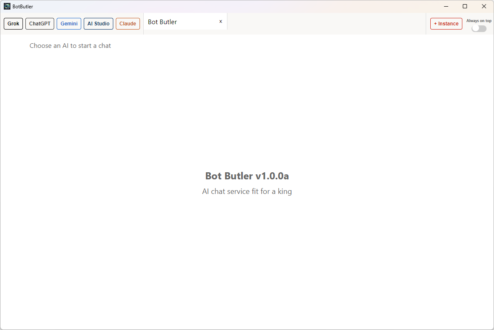

# BotButler v.1.0.0a

botbutler.png

## Description
BotButler is an Electron-based desktop application for Windows 10 and 11 that provides a unified interface for accessing multiple AI assistants including Grok, ChatGPT, Gemini, Google AI Studio and Claude.

## Screenshot

## Features
- Desktop application wrapper for multiple AI assistants:
  - Grok (grok.com)
  - ChatGPT (chat.openai.com)
  - Gemini (gemini.google.com)
  - Google AI Studio (aistudio.google.com)
  - Claude (claude.ai)
- Tabs functionality for multiple conversations
- Support for various authentication methods (Google, Apple, etc.)
- No menu bar for a cleaner interface
- Always-on-top function

## Download
[Download BotButler_Installer-v1.0.0a.exe](https://github.com/AnRkey/BotButler/releases/download/v1.0.0a/BotButler_Installer-v1.0.0a.exe)

## Prerequisites for use
- Windows 10 or 11
- Internet connection
- Accounts for the AI services you wish to use

## Prerequisites for building
- Windows 10 or 11
- Internet connection
- Node.js (LTS version, e.g., 20.x)

## Project Structure
- `src/` - Contains the main Electron application code
  - `main.js` - Main Electron process
  - `preload.js` - Preload script for the renderer process
  - `renderer.js` - Renderer process code
  - `custom-tabs.js` - Custom tabs implementation
  - `botbutler.png` - Application icon
- `index.html` - Main application HTML
- `styles.css` - Application styles
- `build.bat` - Build script for Windows

## Build BotButler
1. Install Node.js from [nodejs.org](https://nodejs.org/).
2. Clone this repository or download the files.
3. Run `build.bat` to build the application.

The build script will automatically:
- Clean previous build files
- Create the build directory
- Check for Node.js and npm installation
- Configure npm for optimal performance
- Install project dependencies if needed
- Install electron-builder globally
- Build the NSIS installer application
- All build outputs will be placed in the `build` directory.

## Usage
- Run the build.bat file to build BotButler and its installer.
- Install `BotButler` with the BotButler_Installer-v1.0.0a.exe from the build directory
- Launch `BotButler` from the Start Menu
- Use the buttons in the top toolbar to open tabs for different AI assistants
- Click the AOT button in the top right to toggle always-on-top functionality.

## Support
Need help? Found a bug? Have a feature request? Please submit an issue on GitHub:

When submitting an issue, please include:
1. Your operating system version
2. Application version you're using
3. Detailed steps to reproduce the problem
4. Screenshots if applicable
5. Any error messages you received

This helps me address your problem more efficiently. You can also check if your issue has already been reported by browsing the [existing issues](https://github.com/AnRkey/BotButler/issues).

## Feedback
Your feedback is valuable and helps improve BotButler! Here are ways to provide feedback:

- **Feature Requests**: Have an idea to make BotButler better? [Submit a feature request](https://github.com/AnRkey/BotButler/issues/new?labels=enhancement&template=feature_request.md&title=%5BFEATURE%5D) on GitHub.
- **General Feedback**: For general comments, suggestions, or experiences using the application, you can:
  - Send an email to anrkey@gmail.com with the subject "BotButler Feedback"
  - Leave a comment on the [releases page](https://github.com/AnRkey/BotButler/releases)

All feedback is reviewed and considered for future updates. Thank you for helping make BotButler better!

## License
This project is licensed under the GNU General Public License version 2.0 (GPL-2.0). See the [LICENSE](LICENSE) file for details.

## Contact
Contact an R key at anrkey@gmail.com

## Copyright Notice
The application icons and logos are either created for this project or found online.
If you are from any of the AI companies and if my use of any artwork is a problem, please let me know and I'll remove it.

## Contributing
See [CONTRIBUTING.md](CONTRIBUTING.md) for details on how to contribute to this project.
